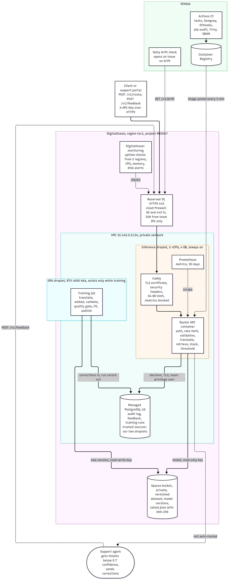

# Architecture

The end-to-end system that serves the ticket router on DigitalOcean. Every component
below exists in the DigitalOcean account (project **MIS547**, region **tor1**, tag
`team3`) and is defined in code in [infra/terraform](../infra/terraform).

The diagram source is [architecture.mmd](architecture.mmd) (Mermaid), rendered to
`architecture.png` and `architecture.svg` for the report.

Live endpoint: **https://146-190-188-160.sslip.io** (API keys are given out separately).

## GPU capacity is not guaranteed

When the training droplet was first requested on 2026-09-29, both the RTX 4000 Ada and the
RTX 6000 Ada were sold out, even while DigitalOcean's size list still offered them in tor1.
`infra/scripts/wait-for-gpu.sh` retries creation every two minutes, cheapest size first,
and got an RTX 4000 Ada a few minutes later. A production plan has to allow for this: keep
the last good model serving (the pipeline only promotes through the gate), and retry or fall
back to another size or region for training.

## What happens to one ticket

1. A client sends `POST /v1/route` with the ticket's subject and body over HTTPS to
   the API's reserved IP. The hostname is `<ip-with-dashes>.sslip.io`, which lets Caddy
   obtain a real Let's Encrypt certificate without buying a domain.
2. The cloud firewall admits only ports 80 and 443 from the internet. Caddy redirects
   HTTP to HTTPS, caps the request at 64 KB, adds security headers, blocks `/metrics`
   from outside, and forwards to the API container on the private Docker network.
3. The API checks the `X-API-Key` header and a per-key rate limit, validates the input,
   translates German sentences to English with the pinned opus-mt model, and scores the
   ticket against about 35,500 labelled tickets (final/model.py).
4. If the top queue's probability is at least 0.7 the ticket is routed automatically.
   Otherwise it goes to a person with the top three queues attached. At 0.7 that is 87%
   of tickets routed automatically at 98.3% accuracy.
5. The decision is written to the audit log in Managed PostgreSQL over the private
   network (TLS, least-privilege user). If that write fails, the answer is still
   returned but `auto_routed` is forced to false, so no automated decision is made
   without a record.
6. The response carries a `ticket_id`. A support agent who corrects the routing sends
   `POST /v1/feedback`, which is stored next to the prediction.

## How the model is trained and shipped

1. When a refresh is due, `terraform apply -var training_enabled=true` creates the GPU
   droplet. Cloud-init installs the team's logins and clones the repository.
2. `deploy/train.sh` builds the CUDA environment and runs the pipeline
   (src/mlops/train_pipeline.py): translate the German pool on the GPU, embed it,
   validate the evaluated recipe on the validation slice, pull corrected tickets from the
   audit log, fit the production model, and apply the quality gate.
3. The artifact (about 185 MB) and its metrics go to Spaces under `models/<version>/`.
   If the gate passes, `models/latest.json` is moved to the new version with its SHA-256.
   Every run, promoted or rejected, is recorded in the `training_runs` table.
4. The API polls `latest.json`, downloads the new artifact, checks the hash, and swaps
   the model in memory without a restart.
5. `terraform apply -var training_enabled=false` destroys the GPU droplet. It bills by the
   hour while it exists, even powered off.

Code ships separately from the model. A push to `main` runs CI (tests, Semgrep, Gitleaks,
pip-audit, Terraform validation), builds the image, scans it with Trivy, attaches an SBOM,
and publishes it to GitHub Container Registry. The inference droplet checks the registry
every five minutes and rolls to the new image, with a health check and automatic rollback.

## Components and why each one is there

| Component | What it is | Why it is needed | Sizing and justification |
| --- | --- | --- | --- |
| VPC `team3-ticket-routing-vpc` | Private network 10.140.0.0/24 in tor1 | Keeps database and droplet traffic off the public internet | Free. tor1 because it is the only region with the RTX 4000 Ada GPU, and every component must share the GPU's region to share its private network |
| Inference droplet | Ubuntu 24.04, 2 shared vCPU, 4 GB, Docker Compose (API, Caddy, Prometheus) | Always-on online inference, answers while a ticket is submitted | $24/month. The router holds 2.0 GB resident (two pretrained models plus 185 MB of pools). Measured on the live droplet: a median of 0.81 s per English ticket and 4.5 s per German one, see Latency below. A GPU here would sit idle, since serving is one ticket at a time |
| Reserved IP | Fixed public IPv4 attached to the inference droplet | The URL in the report survives a rebuilt droplet, which is also the disaster recovery path | Free while attached |
| GPU training droplet | 1x NVIDIA RTX 4000 Ada 20 GB, 8 vCPU, 32 GB, DigitalOcean AI/ML image | Burst compute for translation, embedding and fitting | $0.76/hour, only while a refresh runs. The measured full retrain took 8 minutes, about $0.10. Translating 76,327 German sentences took 3.5 minutes on this GPU against about 11 on the laptop. A company still exploring models would run many such jobs |
| Managed PostgreSQL 16 | 1 vCPU, 1 GB, 10 GB disk, private network only | Audit log of every decision, human corrections, training runs. Structured records with one text field, which fits a relational database | $15/month. A year of traffic at 1,000 tickets a day is about 365,000 rows of roughly 2 KB, under 1 GB. Managed, so backups, patching and failover of the engine are DigitalOcean's job |
| Spaces bucket | S3-compatible object storage, private, versioned | Dataset and every model version, the source of truth the API loads from | $5/month for 250 GB. Each model version is 185 MB, so years of weekly versions fit |
| Cloud firewalls | Tag-based, one for inference, one for training | Only HTTPS in, SSH only from team addresses, egress limited to web, DNS, time and the database | Free |
| Monitoring | DigitalOcean agent alerts (CPU, memory, disk), uptime checks from two regions (down, latency, certificate expiry), Prometheus | Know when the service is down or degrading, from outside the droplet | Free |
| GitHub Actions and GHCR | CI with scanners, image registry | Every change is tested and scanned before it can reach production | Free for a public repository |

No serverless components are used. The one candidate was the daily drift check, and it
runs as a scheduled GitHub Actions workflow instead, which costs nothing and keeps the
API key out of another platform. DigitalOcean Functions would fit the same job.

## Where the heavy compute and bandwidth are

Measured on the RTX 4000 Ada training droplet on 2026-09-29 (evidence/gpu-training-run.log):

| Stage | Compute | Memory | Network | Frequency |
| --- | --- | --- | --- | --- |
| Translation of the German pool | GPU, 212 s (76,327 sentences) | 2.5 GB VRAM | 10 MB text in and out | Once per new batch of non-English tickets |
| Embedding the pools | GPU, 84 s | 2 GB VRAM | 2.2 GB of pretrained models on first run | Each training run |
| Validation of the evaluated recipe | GPU and CPU, 90 s | 8 GB RAM | none | Each training run |
| Fitting the production model | GPU and CPU, 82 s | 8 GB RAM | none | Each training run |
| Publishing | none | none | 185 MB to Spaces, same region | Each training run |
| Model download to the API | none | 185 MB | 185 MB from Spaces, same region | Each promoted version |
| Online inference | CPU, median 0.81 s (English), 4.5 s (German) on the shared 2 vCPU droplet | 2.0 GB | about 2 KB per request | Every ticket |
| Image pull | none | none | about 1.5 GB compressed from GHCR | Each code release |

Serving is light and constant. Training is heavy and rare. That split is the reason for
renting a GPU only for the burst and running inference on a small CPU droplet.

## Latency, measured on the live droplet

Server-side time per ticket on 2026-09-29, from the `stage_ms` field of the audit log, before the fix described below:

| Stage | English ticket | German ticket |
| --- | --- | --- |
| Translation | none | 2.7 to 4.6 s |
| Sentence embedding (e5) | 0.35 to 2.95 s | 0.35 to 0.9 s |
| Retrieval and stacker | 0.29 to 1.2 s | 0.36 to 0.65 s |
| Total | 0.9 to 3.8 s, median about 1.3 s | 3.5 to 5.3 s, median about 4.7 s |

Two causes, both measured. The droplet's vCPUs are shared, and `top` showed 20% CPU steal on
an idle machine, which is why the same ticket's embedding varies eightfold. And retrieval rebuilt
two large matrices on every request. That second one was a bug, fixed in commit 0ec8182 so the
matrices are built once per process. The results are bit-identical. After the fix went out
through the pipeline, the live English median fell from about 1.3 s to **0.81 s** (retrieval from
about 0.45 s to 0.20 s) and the German median from about 4.7 s to 4.5 s
(evidence/cd-rollout-and-latency.txt).

For tickets arriving by email or web form, a few seconds is invisible to the customer, because
routing happens after submission. If the bank wanted a sub-second target, the fix is a dedicated
CPU plan: a CPU-Optimized droplet (`c-2`, 2 dedicated vCPU, 4 GB, $42 a month, one Terraform
variable) removes the steal. That is the trade the report can put to stakeholders, $18 a month
more for predictable latency.

## What changed from the midterm diagram

The midterm diagram was a proposal. This table maps each part of it to what now exists.

| Midterm diagram | Now |
| --- | --- |
| Cloud firewall in front of the endpoint | Two tag-based firewalls, plus HTTPS through Caddy and a reserved IP |
| One inference droplet running a container | Same, with Compose running the API, Caddy and Prometheus, and pull-based updates |
| Managed PostgreSQL in a private subnet | Managed PostgreSQL reachable only from our two tagged droplets over the VPC, with two least-privilege users |
| Spaces with the dataset and every model version | Same, versioned, with bucket-scoped read-only and read-write keys and SHA-256 checks |
| Training droplet in its own private subnet, monthly retraining | GPU droplet that exists only during a training run, accepts no inbound traffic but SSH from team addresses, and publishes through a quality gate |
| TF-IDF plus logistic regression, DistilBERT explored | Retrieval plus a gradient-boosted stacker over English and translated German tickets |

DigitalOcean VPCs do not have separate public and private subnets. The isolation the
midterm drew as subnets is enforced by the firewalls and the database's trusted sources.

## High availability

See [HIGH_AVAILABILITY.md](HIGH_AVAILABILITY.md) for the answers to the midterm feedback.
In short, the proof of concept runs one inference droplet with Docker restart policies,
health and readiness checks, an outside uptime check and automatic image rollback. A
second droplet behind a DigitalOcean load balancer, polling `/readyz`, is the production
step. It is one Terraform change and $36 a month more.
